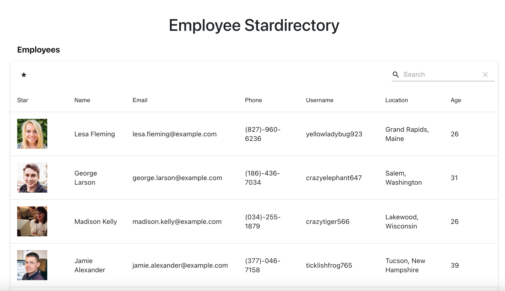

# Employee-Stardirectory

Looking for a place to catalog your employees? We have you covered. Employee Stardirectory is the best place in the universe!

## Project Details

Welcome to the Employee Stardirectory!

This application was developed and created for star companies near and far. Keep track of all the employees that work for your company in a slick, easy to use database, that catalogs crucial employee data. A search bar is included for high-functionality and performance, so as to find employees in an instance. The database even sorts users in ascending and descending order, depending on your desired output. We believe you are going to fall in love with the Employee Stardirectory.

Thanks for stopping in!

## Application

Employee Stardirectory: https://michaelwitt.github.io/Employee-Stardirectory/

Welcome: 

## Build Details

This application was developed using: React.js, Components, Material-Table, Axios, Bootstrap, JavaScript, Node.js, the Random User API, and more!

## Repository & Preview

View the repository at: https://github.com/MichaelWitt/Employee-Stardirectory

Preview: 

## Updates

You can find project updates in the repository, highlighting what was done to create the final product.

https://github.com/MichaelWitt/Employee-Stardirectory/commits/

## Credits

UNC Coding Bootcamp And Trilogy for the inspiration.

As well as NPM Material-Table, Random User API, Bootstrap, React, Axios, and other NPM Packages.

Thanks!

## Thanks For Visiting!

Come back soon :)
